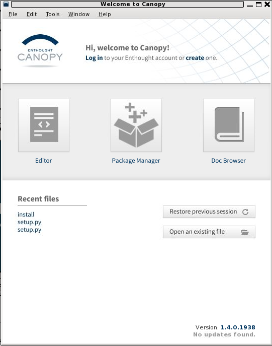
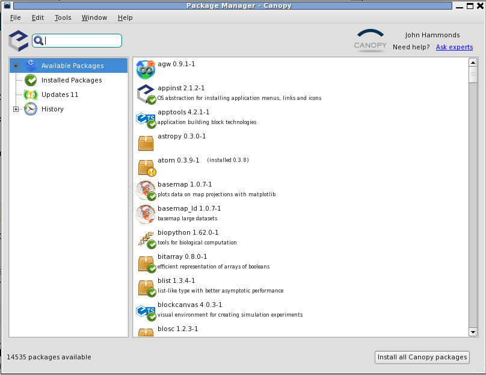
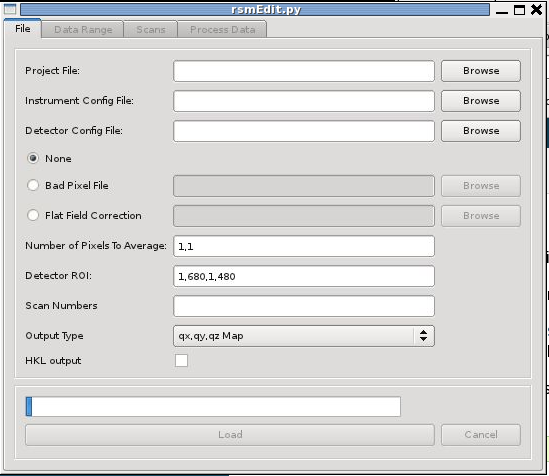

Installation of rsMap3D on Mac/OSX Host
========================================

These installation instructions assume the use of the Enthought Canopy Python 
distribution.  We use Canopy for these instructions as it is the default Python 
environment used at this time.  For these instructions Canopy 1.4.0 and the 
packages provided by Canopy were used as much as possible.  The description 
written here was put together using a fresh Canopy install in order to provide 
as much information as possible for the beginning user.

In order to install run rsmMap3D the user will need to install Canopy, use the 
package manager to install/check the install of a number of other python 
packages and then install:

* xrayutilities from http://sourceforge.net/projects/xrayutilities
* pyspec from https://github.com/stuwilkins/pyspec
* And then download the source for rsMap3D from https://subversion.xray.aps.anl.gov/RSM/rsMap3D/trunk/

Installation and setup of Canopy
--------------------------------
Enthought Canopy is a commercial bundling of Python.  It is available from 

https://www.enthought.com/

In order to install Canopy (the "free version" will not work) the user will 
need to register for an account with Enthought.  The Argonne has a subscription 
for Enthought Python.  Argonne staff can register with their ANL e-mails and 
will get access to the full version.  Academic licenses are also available.  
Academic users can request an academic license.  Note that the Canopy Free 
version will not work on it's own since rsMap3D requires VTK and this is not 
included with the Free version.  Once you have an account, you can go to the 
Canopy web site, select Get Canopy and you should see something like the 
following.

.. image:: Images/Enthought_Download_Page.png

With an authorized login, you should see the orange box near the to prompting 
you to download.  Go to the Enthought page and download the Canopy 
distribution (canopy-1.4.0-osx-64.dmg as of this writing).  Double clicking 
this file will bring up a small installer window as shown below.  

.. image:: Images/Mac_canopy_installer.png

This window indicates that you should drag the Canopy icon into the 
Applications icon on this window.  Dragging to the Applications icon in this 
screen will attempt to install Canopy in the system's applications directory.  
To do this, you will need root access to the machine.  You can install to the 
user's application directory (which does not require root) by opening a Finder 
window and selecting the user's Application directory.  Then simply drag the 
Canopy icon into the User's Application folder in the Finder window.

Once the installer is done, it will prompt the user to make Canopy the default 
version of python.  If this is acceptable, then answer yes.  This will greatly 
simplify running the Canopy python.  Once canopy is installed, launch canopy to 
ensure that all necessary packages are installed.  To do this you will need to 
log in with your Enthought account. 

Once logged in, press the Package Manager button.  This will allow you to 
explore the installed packages and to install a number of other packages 
maintained by Enthought.  An example of this is shown below.

Note that entering a package name in the upper left will search for a package.  
For rsMap3D we need to make sure that the following packages are installed: 
numpy, vtk, pytables and PyQt4.  With Canopy 1.4.0 we see that

* numpy  1.8.0-1 is already installed
* PyQt4 4.10.3-1 is available for installation 
* Vtk 5.10.1-1 is available for installation
* Pytables 2.4.0-5 is available for installation

Make sure to install these packages now.  Note that we will also need 
xrayutilities and pyspec but the version of these tools is older than the 
version being used to develop rsMap3D so we will download and install versions 
of these.

Installing xrayutilities
------------------------
Xrayutilities is a package written by Dominik Kriegner and Eugen Wintersberger.  
We are presently using version 1.0.6 of xrayutilities.  This package can be 
downloaded as a tar.gz file from http://sourceforge.net/projects/xrayutilities/.

To unbundle the package in the user's home directory (i.e ~/xrayutilities-1.0.6):

.. code-block:: none

  cd ~
  tar -xzvf 'path to file'/xrayutilities-1.0.6.tar.gz

This package includes a setup.py file to help with the install.   To install 
xrayutilities run:

.. code-block:: none

  cd ~/xrayutilities-1.0.6
  python setup.py --without-openmp install       

(Note that if you failed to make Canopy's python the system default it is in 
~/Library/Enthought/Canopy_64bit/User/bin)

Installing pySpec 
-------------------
pySpec is a python package written by Stuart Wilkins.  We have been downloading 
the latest version of pyspec from the repository on github.  To download into 
the user's home directory (i.e. ~/pyspec):

.. code-block:: none

 cd ~
 git clone https://github.com/stuwilkins/pyspec
 
Like xrayutilities, pyspec comes with a setup.py file to help with the 
installation.  To install pyspec run:

.. code-block:: none

 cd ~/pyspec
 python setup.py install

(Note that if you failed to make Canopy's python the system default it is in ~/Library/Enthought/Canopy_64bit/User/bin)

Installing rsMap3D
-------------------

Unlike the last two packages rsMap3D does not have a setup.py.  It is currently 
installed in a directory, this directory is set in the PYTHONPATH and the 
application is run.

To install this package in the user's home directory ~/rsmap3d:

.. code-block:: none

 cd ~
 svn co https://subversion.xray.aps.anl.gov/RSM/rsMap3D/trunk/ rsmap3d.

We can now set the python path and run the application.  

.. code-block:: none

export  PYTHONPATH=/Users/'username'/rsmap3d
python --m rsMap3D.rsmEdit.

You will then see a window like the following:

You are now ready to start using rsMap3D.

