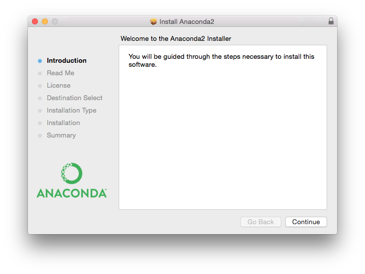
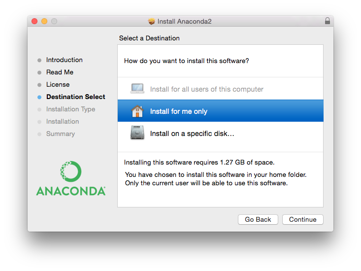
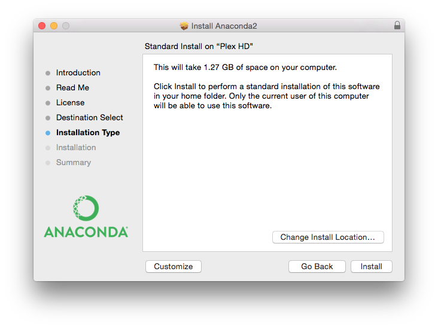

Installation of rsMap3D on Linux Host
=====================================
These installation instructions assume the use of the Anaconda Python 
distribution.  For these instructions, Anaconda 5.x (Images May be from 2.5) 
and the packages provided by Anaconda were used as much as possible.  At 
this time, the current version available from anaconda.org is 2018.12.

In order to install run rsmMap3D the user will need to install Anaconda, and 
install/check the install of a number of other python packages and then install:

*	`xrayutilities <http://sourceforge.net/projects/xrayutilities>`_
*	`spec2nexus <http://spec2nexus.readthedocs.org/en/latest/>`_
*	`rsMap3D <https://github.com/AdvancedPhotonSource/rsMap3D/wiki>`_

Installation and setup of Anaconda
----------------------------------
`Anaconda <https://www.anaconda.com/distribution/>`_ is a free bundling 
of Python and over 1500 open source Python packages.  Support is available 
through open community or, for more advanced solutions, through paid support
from Anaconda, Inc.  Anaconda provides installers for both Python 2.7 
and 3.x.  Each has a different version of Python as a default.  Note 
that although these installations are essentially the same, it is 
recommended that **if this your first install of Anaconda that you install the Python 3** 
version of Anaconda for more convenience since rsMap now requires Python 3.  
If you have already installed Python 2 version of Anaconda you can still 
use Python 3, but will need to create a 
`Python 3 environment,<https://docs.conda.io/projects/conda/en/latest/user-guide/tasks/manage-environments.html>`.  
Working in a python environment is suggested in either case since this will
allow separation of the requirements of different Python applications.

These instructions assume that you will install the Python 3.x, 64-bit 
graphical installer.  Launching this installer should present a window like:

Clicking next you will be asked to accept the license agreement.  You will 
then be prompted to select an installation type see image below.  Anaconda 
allows installation on a per user basis ("Install for me only") or for all users 
(requires admin privilege).  

This installation assumes selection of "Install for me only" 
which requires only normal user privilege.  In this case anaconda will be 
installed in the user's home directory by default.  Before final installation 
the user will be prompted for installation type (see image).  This allows 
customization of installed packages and location.  It is recommended to accept 
the defaults here.  Accepting defaults should add python executables to the
user's PATH environment variable.  It will take some time to complete 
the installation since Anaconda provides many common packages by default.  

For rsMap3D we need to make sure that the following packages are installed: 
numpy, vtk,scypy pillow and pyqt.  Installation can be verified by launching an 
Anaconda prompt from Start->All Programs->Anaconda2 (64-bit).  We can verify 
package installation with 

.. code-block:: none

   conda search <packagename> at the prompt.

If you previously installed Anaconda (you see older versions of packages 
than listed here) you may need to update your distribution.  At this time, 
Anaconda 5.x is being used and the following packages are available and 
those not installed by default can be installed with the command.

.. code-block:: none

   conda install <packagename>

As mentioned earlier, it is suggested to run rsMap3D using a *Python 
environment*.  *Python environments* allow creating a separate space for 
an application to run, separating it's package requirements from other 
applications.  An example of this is the ability to run one application
using Python 2 and another in Python 3.  Anaconda and it's conda package 
manager allow creation of a *Python environment*.  More information on 
managing environments in python can be found here:  
https://docs.conda.io/projects/conda/en/latest/user-guide/tasks/manage-environments.html

After installing Python 3 and optionally creating a *Python environment* 
ensure that the following packages are installed.  If not, use the conda 
install command listed above.

Required packages

* numpy  1.16.2 
* pyqt 5.9.2 
* vtk 8.2.0 
* h5py 2.5.0 
* pillow 5.4.1
* scipy  1.2.1

Make sure to install these packages now.  Note that we will also need 
xrayutilities and spec2nexus (described below). 

Installing xrayutilities
-------------------------
Xrayutilities is a package written by Dominik Kriegner and Eugen Wintersberger.  
We are presently using version 1.5.1 of xrayutilities.  This package can be 
downloaded as a tar.gz file from http://sourceforge.net/projects/xrayutilities/.

To unbundle the package in /local/xrayutilities-1.5.1:

.. code-block:: sh

 cd /local
 tar -xzvf 'path to file'/xrayutilities-1.5.1.tar.gz

This package includes a setup.py file to help with the install.   To install xrayutilities run:

.. code-block:: sh

 cd /local/xrayutilities-1.5.1
 ~/Enthought/Canopy_64bit/User/bin/python setup.py install

Installing spec2nexus 
---------------------
spec2nexus is a python package written by Pete Jemian at the APS.  This package
provides a subpackage that enables parsing spec files in python.  This package
has been used in places to read spec files  as input for the rsMap3D.  Note 
that rsMap3D requires at least version 2016.216.0.  

.. code-block:: none

   pip install spec2nexus
   
Installing rsMap3D
--------------------

rsMap3D is now available as a package on the `Python Package Index 
<https://pypi.python.org/pypi?>`_.  This allows installation of rsMap3D using 
the python pip installer

.. code-block:: none

   pip install rsMap3D
 
A windows .bat file is installed in the path defined by the python installation
(the Scripts subdirectory for the Anaconda distribution).  The application can 
be launched by running 

.. code-block:: none

 python -m rsMap3D.rsmEdit
 
You will then see a window like the following:

.. image:: Images/rsMap3DonLaunch2.png

You are now ready to start using rsMap3D.

