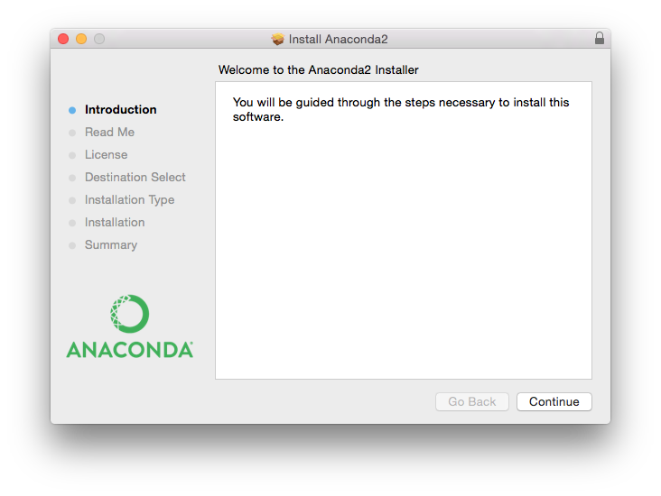
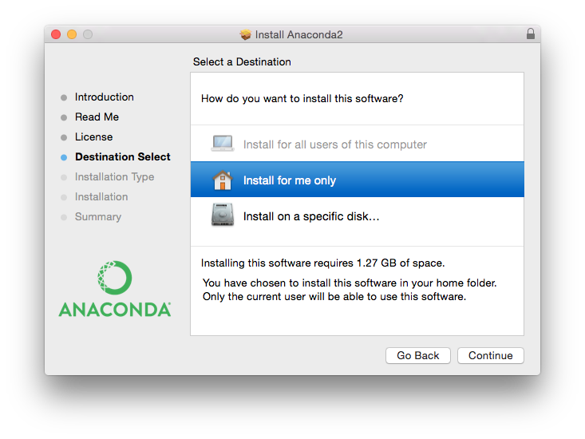
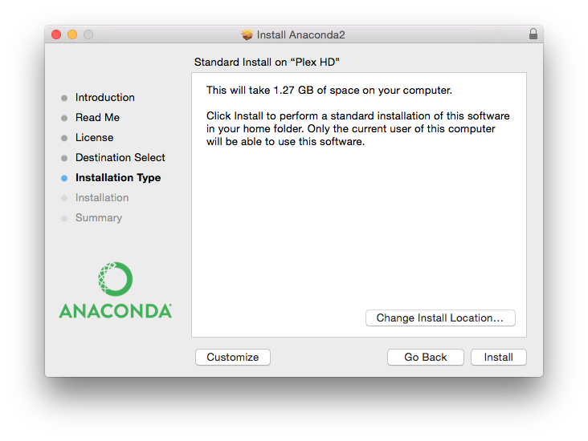

Installation of rsMap3D on Mac/OSX Host
========================================

These installation instructions assume the use of the Anaconda Python 
distribution from Continuum Analytics.  We use Canopy for these instructions as 
it is the default Python environment used by the Advanced Photon Source at this 
time.  For these instructions, Anaconda 2.5.0 and the packages provided by 
Anaconda were used as much as possible.  The description written here was put 
together using a fresh Anaconda install in order to provide as much information 
as possible for the beginning user.

In order to install run rsmMap3D the user will need to install Anaconda, and 
install/check the install of a number of other python packages and then install:

*	`xrayutilities <http://sourceforge.net/projects/xrayutilities>`_
*	`spec2nexus <http://spec2nexus.readthedocs.org/en/latest/>`_
*	And then download the source for `rsMap3D <https://subversion.xray.aps.anl.gov/RSM/rsMap3D/trunk/>`_

Installation and setup of Canopy
--------------------------------
`Anaconda <https://www.continuum.io/downloads>`_ is a completly free bundling 
of Python by Continuum Analytics.  Note that although Continuum Analytics does 
provide Anaconda at no cost, it does provide `some additional levels of support 
<https://www.continuum.io/support-plan>`_ for a fee
.
To install Anaconda Python, go to the download site mentioned above you should 
see a web page with a section that looks like

These instructions assume that you will install the Python 2.7, 64-bit 
graphical installer.  Launching this installer should present a window like:

Clicking next you will be asked to accept the license agreement.  You will 
then be prompted to select an installation type see image below.  Anaconda 
allows installation on a per user basis ("Install for me only") or for all users 
(requires admin privilege).  

This installation assumes selection of "Install for me only" 
which requires only normal user privilege.  In this case anaconda will be 
installed in the user's home directory by default.  Before final installation 
the user will be prompted for installation type (see image).  This allows 
customization of installed packages and location.  It is recommended to accept 
the defaults here.  Accepting defaults should add python executables to the
user's PATH environment variable.  It will take some time to complete 
the installation since Anaconda provides many common packages by default.  

For rsMap3D we need to make sure that the following packages are installed: 
numpy, vtk, pytables and PyQt4.  Installation can be verified by launching 
Terminal (Applications->Utilities->Terminal) and running 

.. code-block:: none

   conda search <packagename> at the prompt.

At this time, Anaconda 2.5.0 is being used and the following packages are 
available and those not installed by default can be installed with the command

.. code-block:: none

   conda install <packagename>

Required packages

* numpy  1.10.4 is already installed
* pyqt 4.11.4 is already for installation 
* vtk 6.3.0 is available for installation
* pytables 3.2.2 is installed
* h5py 2.5.0 is installed
* pillow 3.1.0 is installed (or pil)

Make sure to install these packages now.  Note that we will also need 
xrayutilities and spec2nexus (described below). 

Installing xrayutilities
------------------------
Xrayutilities is a package written by Dominik Kriegner and Eugen Wintersberger.  
We are presently using version 1.2.1 of xrayutilities.  This package can be 
downloaded as a tar.gz file from http://sourceforge.net/projects/xrayutilities/.

To unbundle the package in the user's home directory (i.e ~/xrayutilities-1.2.1):

.. code-block:: none

  cd ~
  tar -xzvf 'path to file'/xrayutilities-1.2.1.tar.gz

This package includes a setup.py file to help with the install.   To install 
xrayutilities run:

.. code-block:: none

  cd ~/xrayutilities-1.2.1
  python setup.py --without-openmp install       

Installing spec2nexus 
---------------------
spec2nexus is a python package written by Pete Jemian at the APS.  This package
provides a subpackage that enables parsing spec files in python.  This package
has been used in places to read spec files  as input for the rsMap3D.  Note 
that rsMap3D requires at least version 2016.216.0.  Although the installation
instructions suggest this can be installed with the conda installer, this 
method currently installs an older version.  To install the correct version 
use:

.. code-block:: none

   pip install spec2nexus
   
Installing rsMap3D
-------------------

rsMap3D is now available as a package on the `Python Package Index 
<https://pypi.python.org/pypi?>`_.  This allows installation of 
rsMap3D using pip

.. code-block:: none

   pip install rsMap3D
 
A windows .bat file is installed in the path defined by the python installation
(the Scripts subdirectory for the Anaconda distribution).  The application can 
be launched by running 

.. code-block:: none

 python -m rsMap3D.rsmEdit
 
You will then see a window like the following:

.. image:: Images/rsMap3DonLaunch2.png

You are now ready to start using rsMap3D.

