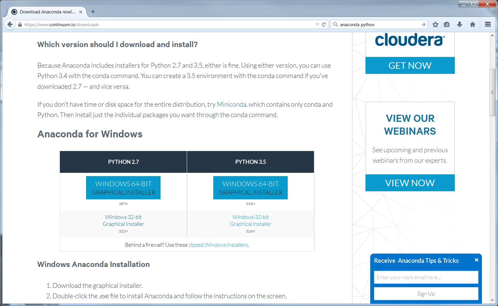
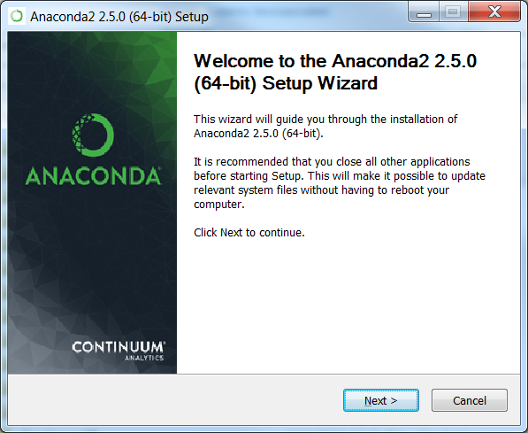
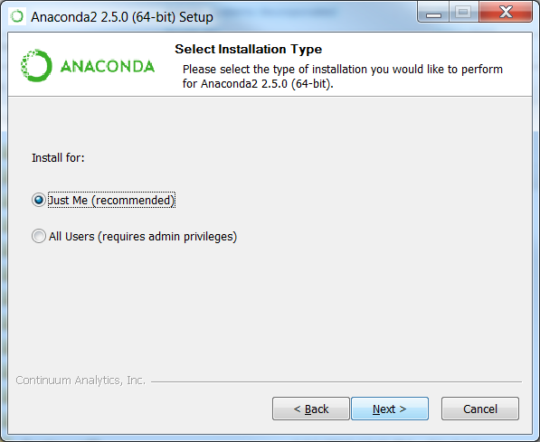
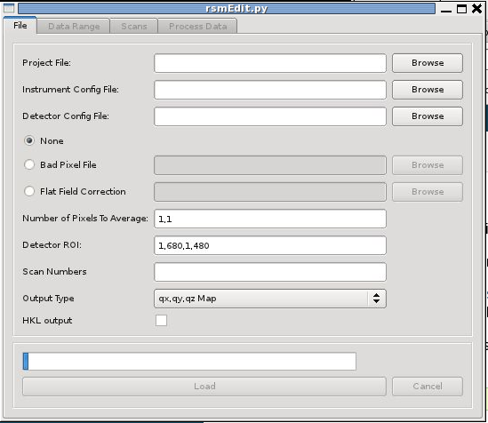

Installation of rsMap3D on Windows Host
=======================================
These installation instructions assume the use of the Anaconda Python 
distribution from Continuum Analytics.  We use Canopy for these instructions as 
it is the default Python environment used by the Advanced Photon Source at this 
time.  For these instructions, Anaconda 2.5.0 and the packages provided by 
Anaconda were used as much as possible.  The description written here was put 
together using a fresh Anaconda install in order to provide as much information 
as possible for the beginning user.

In order to install run rsmMap3D the user will need to install Anaconda, and 
install/check the install of a number of other python packages and then install:

*	`xrayutilities <http://sourceforge.net/projects/xrayutilities>`_
*	`spec2nexus <http://spec2nexus.readthedocs.org/en/latest/>`_
*	And then download the source for `rsMap3D <https://subversion.xray.aps.anl.gov/RSM/rsMap3D/trunk/>`_

Installation and setup of Anaconda
----------------------------------
`Anaconda <https://www.continuum.io/downloads>`_ is a completly free bundling 
of Python by Continuum Analytics.  Note that although Continuum Analytics does 
provide Anaconda at no cost, it does provide `some additional levels of support 
<https://www.continuum.io/support-plan>`_ for a fee
.
To install Anaconda Python, go to the download site mentioned above you should 
see a web page with a section that looks like

These instructions assume that you will install the Python 2.7, 64-bit 
graphical installer.  Launching this installer should present a window like:

Clicking next you will be asked to accept the license agreement.  You will 
then be prompted to select an installation type see image below.  Anaconda 
allows installation on a per user basis ("Just Me") or for all users 
(requires admin privilege).  

This installation assumes selection of "Just Me" 
which requires only normal user privilege.  Before final installation the user 
will be prompted for installation location and permission to modify the path to 
include path to installed executables.  It is recommended to accept the 
defaults here.  It will take some time to complete 
the installation since Anaconda provides many common packages by default.  

For rsMap3D we need to make sure that the following packages are installed: 
numpy, vtk, pytables and PyQt4.  Installation can be verified by launching an 
Anaconda prompt from Start->All Programs->Anaconda2 (64-bit).  We can verify 
package installation with 

.. code-block:: none

   conda search <packagename> at the prompt.

At this time, Anaconda 2.5.0 is being used and the following packages are 
available and those not installed by default can be installed with the command

.. code-block:: none

   conda install <packagename>

Required packages

* numpy  1.10.4 is already installed
* pyqt 4.11.4 is already for installation 
* vtk 6.3.0 is available for installation
* pytables 3.2.2 is installed
* h5py 2.5.0 is installed
* pil 1.1.7 is available to install

Make sure to install these packages now.  Note that we will also need 
xrayutilities and spec2nexus (described below). 

Installing xrayutilities
------------------------
Xrayutilities is a package written by Dominik Kriegner and Eugen Wintersberger. 
We are presently using version 1.2.1 of xrayutilities.  Although the source 
code for this package can be downloaded and built as a `tar.gz
<http://sourceforge.net/projects/xrayutilities/>`_ although a precompiled 
distribution for windows is provided as a `wheel file
<https://confluence.aps.anl.gov/display/RSM/Binary+Distributions+of+Python+Packages>`_.
This wheel is recommended since this file was compile using the Microsoft 
Visual Studio 2008 compiler (the same used for compiling Anaconda Python).  

This wheel file can be installed with 

.. code-block:: none

   pip install xrayutilities-<long version info>.whl

Installing spec2nexus 
---------------------
spec2nexus is a python package written by Pete Jemian at the APS.  This package
provides a subpackage that enables parsing spec files in python.  This package
has been used in places to read spec files  as input for the rsMap3D.  Note 
that rsMap3D requires at least version 2016.216.0.  Although the installation
instructions suggest this can be installed with the conda installer, this 
method currently installs an older version.  To install the correct version 
use:

.. code-block:: none

   pip install spec2nexus
   
Installing rsMap3D
------------------
Unlike the last two packages rsMap3D does not have a setup.py.  It is currently 
installed in a directory, This directory is set in the PYTHONPATH and the 
application is run.

Tortise Git adds menu options on the left click in explorer.  Right click on 
C:\\Users\\'username' and select 'Git Clone...'  In the window that appears enter 
https://subversion.xray.aps.anl.gov/RSM/rsMap3D/trunk/.
 
We can now set the python path and run the application.  

.. code-block:: none

 setenv PYTHONPATH /local/rsmap3d
 ~/Enthought/Canopy_64bit/User/bin/python -m rsMap3D.rsmEdit.

You will then see a window like the following:

You are now ready to start using rsMap3D.

