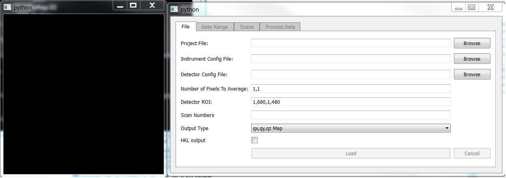
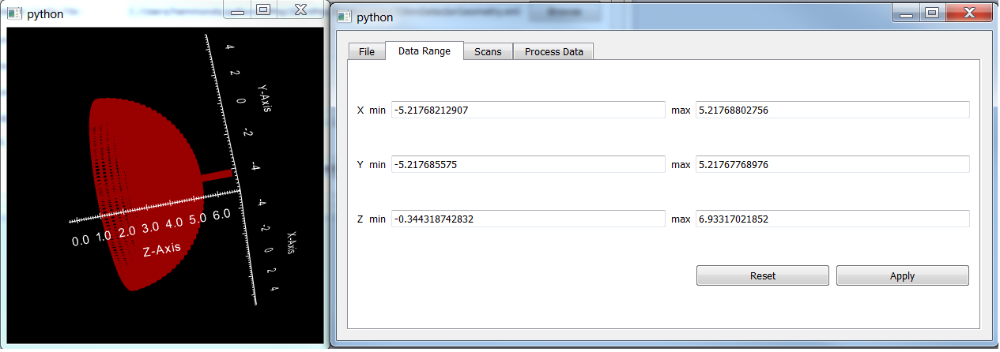
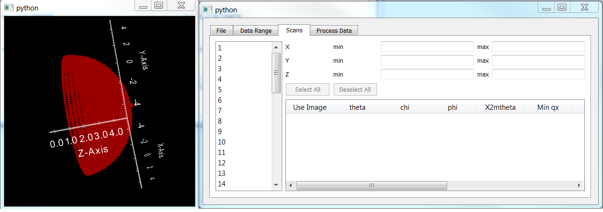
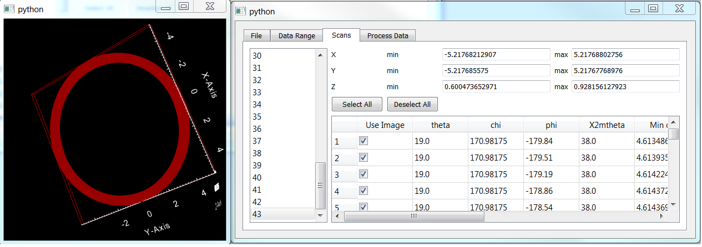
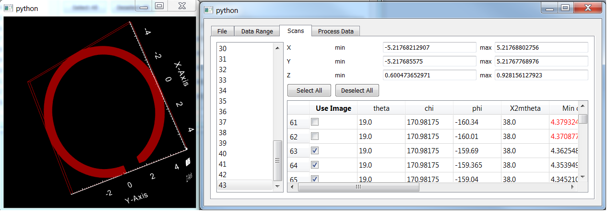
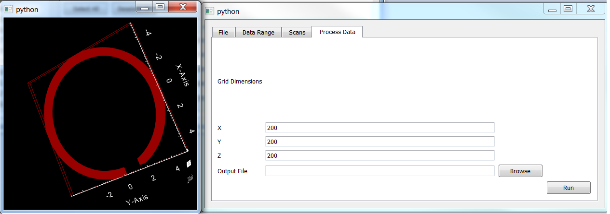

Processing Data with rsMap3D
============================
Software Services Group

Advanced Photon Source

Argonne National Laboratory

Introduction
--------------
rsMap3D is an application for producing 3D reciprocal space maps from x-ray 
diffraction data.  This application allows the user to select input files, 
view a 3D representation of the data volume sampled during a set of 
measurements, select a subset of the data, and processes the data 
into a 3D map.

rsMap3D is written in python and relies on a number of external python 
modules.  These modules include:

* numpy
* PyQt4
* vtk
* pyspec
* xrayutilities
 
Many of these modules are installed in many prepackaged distributions of 
python.  Others, such as pyspec and xrayutilities, may need manual 
installation.  A separate manual has been developed for installing rsMap3D.

Running rsMap3D
---------------
Once rsMap3D is installed, it can be run by issuing the following command:

.. code-block:: sh

  python -m rsMap3D.rsmEdit

After launching you should see a screen that looks like this:

The black box on the left is a 3D display which will display the extent of 
data volumes for all scans or a subset of selected scans, depending on the tab 
selected in the right box.  The right box is used for entering input files, 
selection of scans, and processing the data.  On launch, the only tab active is 
the File tab. The functionality of all tabs is described in the following sections.

File Tab
~~~~~~~~

This tab allows entry of input  files for processing.  The current 
version allows processing of spec data files with a couple of configuration 
files.  The parameters on this page are:

* Project file - This is the spec data file, including the full path.
* Instrument Config File -  This is an XML file to describe parameters such as diffractometer circles, beam direction, etc.
* Detector Config File -  This is an XML file for describing the detector parameters such as size, number of pixels, center, etc.
* Image correction: Options include "None" to simply use the raw images, "Bad Pixel File" to exclude abberant or dead pixels from the analysis, or "Flat Field Correction" to apply the proper sensitivity correction to each pixel in the detector images.
* Number of pixels to average - this parameter allows averaging of pixels in the x and y direction.
* Detector ROI - Describes a region of interest on the detector to be used in processing.
* Scan numbers - This allows entry of a subset of scans to process.  This field is optional.  If left blank, all available scans will be processed. Data can be entered as a "string range", e.g. ``1-3,5``, ``[4,5,8,10]``, ``2-10:2``
* Output Type - The user can select between **qx, qy, qz Map** or **Stereographic projection**
* HKL output - This option is only enabled for **qx, qy, qz Map** and will transform the data to HKL
* Load - Once proper files are set in the entries, this button will become active.  Pressing this will start loading information about detector angles for each scan.  This information is used in the initial presentation of the data volume used.
* Cancel - Allow the user to cancel in the middle of loading the data.

Once data is loaded, the other tabs will be enabled, as shown below.  Note 
that the box on the left now shows a representation of the data volume covered 
by the selected data.

.. image:: Images/rsMap3DafterLoading.png

Data Range Tab
~~~~~~~~~~~~~~

This tab displays the overall range of data selected for processing.  These 
values can be changed.  The new values for these limits will not take effect 
until the apply button is pressed.  The values can be reset to the last 
applied values by pressing reset.  When apply is pressed, any image in the 
available scans which fall completely outside of the new limits will be 
deselected for processing.  This will cause a new image to be drawn on the 
left showing the new set of selected images.  For instance, this image shows 
two components, a dome piece and a stick going through the top (right side of 
the image) of the dome.  These pieces come from a series of phi scans at 
different chi/phi values (the dome) and a series of theta/two theta scans (the 
stick).  By changing Z max to 4.9 we can see that most of the stick piece above 
the dome is missing from the image as the associated images have been 
deselected.  Note that this does not completely eliminate the stick as there 
are more bits of it inside the dome.

Scans tab
~~~~~~~~~~

This tab shows selected information about each image in a selected scan in 
tabular form and displays the data extent for a selected scan in the box on 
the left.  Note that when this is first selected, no scans are selected and 
the image still shows the extent for all images.  When a scan is selected, the 
table is filled with information on each image and the images for that scan 
are shown.

The ring displayed in the image to the right shows the data volume collected 
in one particular scan.  This is a phi scan with 1107 images.  This ring forms 
the bottom section of the dome piece of the scan.

Note that it is possible to select/deselect each image using the checkbox in 
the first column or all images in the scan can be selected/deselected using 
the buttons at the top of the table.  The effect of this is shown in the image 
below.  Note that only selected images will be processed in the next phase.

Here a number of images have been deselected (more than the two shown) and a 
chunk of the ring is missing.  This section of the ring will not be processed 
later.  Note that the ability to manually deselect individual images this way 
is somewhat impractical on a large scale but could be quite useful for a few 
bad images.

Process Data Tab
~~~~~~~~~~~~~~~~

This tab allows entry of some final parameters and the output file name.  The 
input field here allow changing the number of grid points to include in the 
output data in each of the three dimensions.  An output file, currently a vti 
file, associated with the Visualization Toolkit VTK is specified here.  To 
produce the output, click the run button.  Note that it may take several 
minutes for processing to finish.

Viewing Output data
--------------------
rsMap3D is not intended as an application that will view 3D maps of processed 
data.  There are other applications that will handle looking at the output 
files.  We have been using Paraview (http://www.paraview.org/) as a viewer for 
the output files. See `View 3D volume data files in ParaView`_ .
