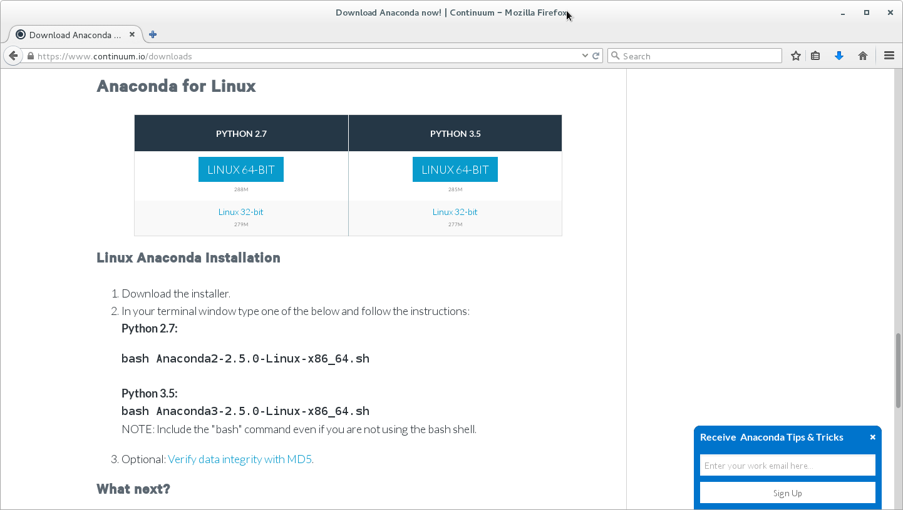

Installation of rsMap3D on Linux Host
=====================================
These installation instructions assume the use of the Anaconda Python 
distribution from Continuum Analytics.  We use Canopy for these instructions as 
it is the default Python environment used by the Advanced Photon Source at this 
time.  For these instructions, Anaconda 2.5.0 and the packages provided by 
Anaconda were used as much as possible.  The description written here was put 
together using a fresh Anaconda install in order to provide as much information 
as possible for the beginning user.

In order to install run rsmMap3D the user will need to install Anaconda, and 
install/check the install of a number of other python packages and then install:

*	`xrayutilities <http://sourceforge.net/projects/xrayutilities>`_
*	`spec2nexus <http://spec2nexus.readthedocs.org/en/latest/>`_
*	And then download the source for `rsMap3D <https://subversion.xray.aps.anl.gov/RSM/rsMap3D/trunk/>`_

Installation and setup of Anaconda
----------------------------------
`Anaconda <https://www.continuum.io/downloads>`_ is a completly free bundling 
of Python by Continuum Analytics.  Note that although Continuum Analytics does 
provide Anaconda at no cost, it does provide `some additional levels of support 
<https://www.continuum.io/support-plan>`_ for a fee
.
To install Anaconda Python, go to the download site mentioned above you should 
see a web page with a section that looks like

Running the installer as described will prompt for acceptance of the license 
agreement and installation directory.  Assuming acceptance of the license 
agreement, enter a location for anaconda installation.  Note that this 
installation does not require administrator privilege, it just requires write 
access to the install director for all that need to provide maintenance.  It 
will take some time to complete the installation since Anaconda provides many 
common packages by default.  

For rsMap3D we need to make sure that the following packages are installed: 
numpy, vtk, pytables and PyQt4.  Installation can be verified by launching an 
Anaconda prompt from Start->All Programs->Anaconda2 (64-bit).  We can verify 
package installation with 

.. code-block:: none

   conda search <packagename> at the prompt.

At this time, Anaconda 2.5.0 is being used and the following packages are 
available and those not installed by default can be installed with the command

.. code-block:: none

   conda install <packagename>

Required packages

* numpy  1.10.4 is already installed
* pyqt 4.11.4 is already for installation 
* vtk 6.3.0 is available for installation
* pytables 3.2.2 is installed
* h5py 2.5.0 is installed
* pillow 3.1.0 is installed (or pil)

Make sure to install these packages now.  Note that we will also need 
xrayutilities and spec2nexus (described below). 

Installing xrayutilities
-------------------------
Xrayutilities is a package written by Dominik Kriegner and Eugen Wintersberger.  
We are presently using version 1.0.6 of xrayutilities.  This package can be 
downloaded as a tar.gz file from http://sourceforge.net/projects/xrayutilities/.

To unbundle the package in /local/xrayutilities-1.0.6:

.. code-block:: sh

 cd /local
 tar -xzvf 'path to file'/xrayutilities-1.0.6.tar.gz

This package includes a setup.py file to help with the install.   To install xrayutilities run:

.. code-block:: sh

 cd /local/xrayutilities-1.0.6
 ~/Enthought/Canopy_64bit/User/bin/python setup.py install

Installing pySpec 
--------------------

pySpec is a python package written by Stuart Wilkins.  We have been downloading the latest version of pyspec from the repository on github.  To download into /local/pyspec:

.. code-block:: sh

 cd /local
 git clone https://github.com/stuwilkins/pyspec

Like xrayutilities, pyspec comes with a setup.py file to help with the installation.  To install pyspec run:

.. code-block:: sh

 cd /local/pyspec
 ~/Enthought/Canopy_64bit/User/bin/python setup.py install
 
Installing rsMap3D
--------------------

rsMap3D is now available as a package on the `Python Package Index 
<https://pypi.python.org/pypi?>`_.  This allows installation of rsMap3D using 
the python pip installer

.. code-block:: none

   pip install rsMap3D
 
A windows .bat file is installed in the path defined by the python installation
(the Scripts subdirectory for the Anaconda distribution).  The application can 
be launched by running 

.. code-block:: none

 python -m rsMap3D.rsmEdit
 
You will then see a window like the following:

.. image:: Images/rsMap3DonLaunch2.png

You are now ready to start using rsMap3D.

